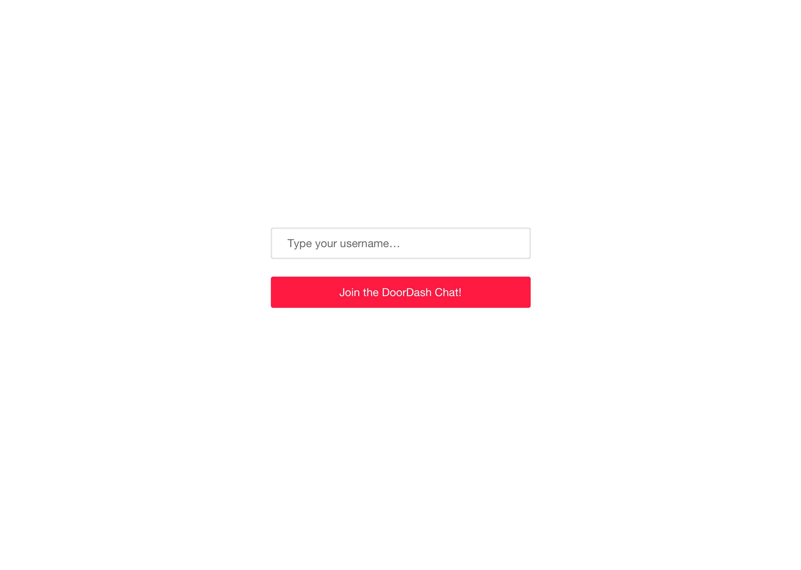
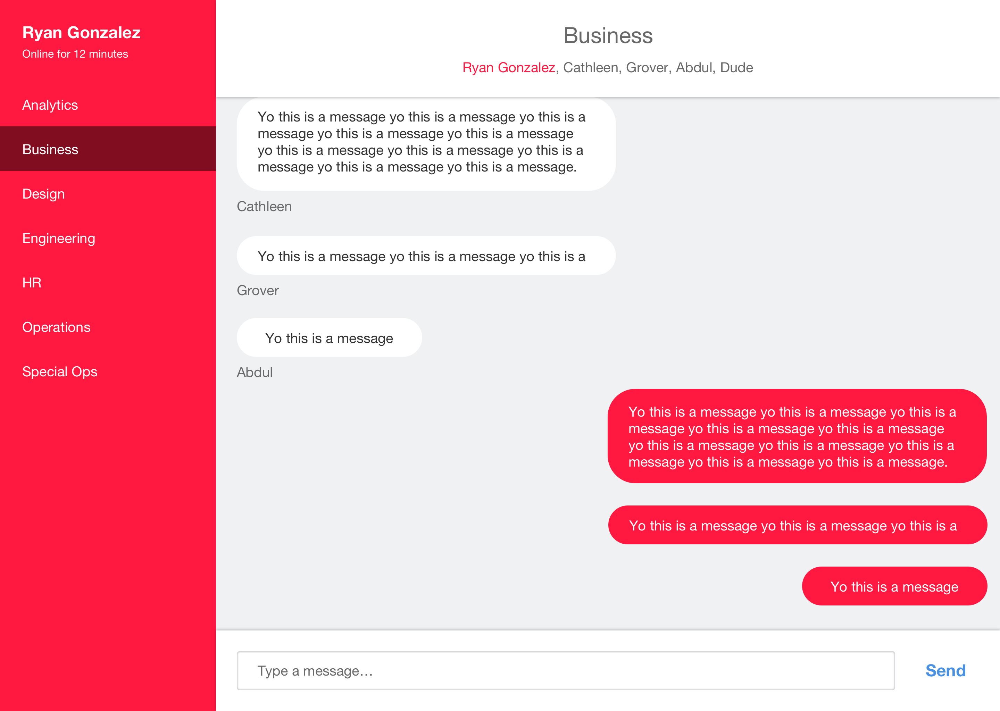

# Detailed design specs
The goal of the app is to take in a username to allow someone to "login", and then see a set of chat rooms with available messages. When you click into a room, you can view past messages, as well as add new messages.

## Set Username
The first screen you should see is the "login" screen. A user can type a username they'll use, and if they provide some string and hit "Join the DoorDash Chat!" button, we'll save their username for when they add new messages.

## Chat
When you've submitted a username, we'll load up the chat interface.

On the left, we have:
* user info
  * username
  * time that user has been online
* list of rooms available

On the right, we have the selected chat room. There, we show:

* room information
  * room name,
  * list of usernames of users in the room
* messages
  * message text
  * username of the user that posted it
  * newest messages on the bottom, older on the top
  * scroll the view to see older messages

## Specifics

* The left panel should be a fixed width, and the right panel should stretch to accommodate
* Should scroll the chat window to the bottom when new messages are added
